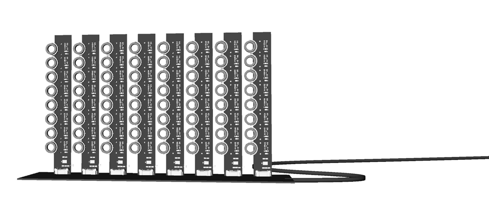
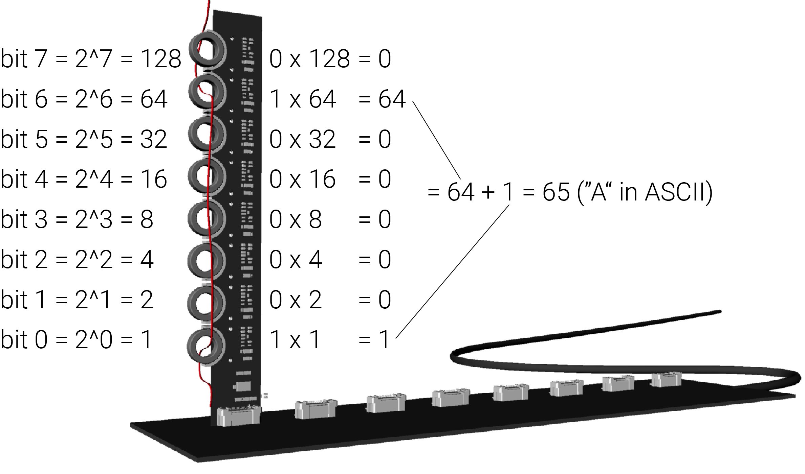
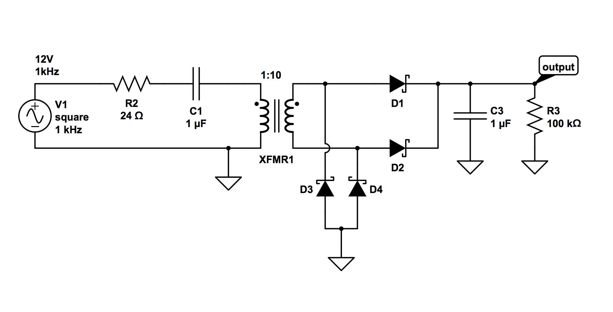

# LINOBYTE

  

## Table of Contents

* [Motivation and Description](#motivation-description)
* [How it works](#how-it-works)
* [Relevance to Ars Electronica 2018](#relevance)
* [Potential presentation formats](#presentation-formats)
* [Important Dates](#dates)
* [Preliminary Functional Block Diagram](#block-diagram)
* [Simulations](#simulations)
* [PCBs](#pcbs)
* [Naming](#naming)
* [To Dos](#to-dos)

## Motivation and Description

As computational devices evolve, more tools and interfaces are built between the user and the machine. This allows us to complete increasingly complex tasks without having to focus so much on understanding the nuances of the machine. While this movement is certainly overall positive, one of the drawbacks is that people no longer learn the fundamental processes and concepts which allow the tool to work. Another negative aspect is that, by neglecting history, we forget the alternatives of the technologies that we use today - forgotten alternatives that maybe once were the status quo. Understanding of those alternatives would give us a broader view of the pros and cons of what we have today, how they superseded their ancestors and what are their pitfalls - important knowledge for those who design possible futures.

Its with these preocupations in mind that Linobyte came into existence. It conciliates the explanation of how bits, bytes and [chars](https://en.wikipedia.org/wiki/Character_(computing)) work, with a hands on experience of creating [Core Rope ROMs](https://en.wikipedia.org/wiki/Core_rope_memory): read-only memories that were written by weaving an enameled copper wire through ferrite cores. 

## How it works

The whole process is quite straightforward, and the result is immediate: the user can write up to 8 characters - a word, in the Linobyte system. Each character consists of one eight-bit byte. Each core represents one bit, and by weaving the conductive wire through the core center, the user sets a bit as positive. By skipping the core, its set as zero. By connecting the wire to the final position, the byte is written.  

So, if the user wants to write the "A" character, the steps should be the following:

1. Find out the binary value in ASCII of the "A" character by checking on the ASCII table (see image below). "A" in ASCII is 65 in decimal and 01000001 in binary.
2. Figure out which bits have to be set in the "Char" board: the first bit (least significant), or bit 0. And the seventh bit, bit 6. (bits are being counted from the right to left)
3. Weave a wire through the respective coils: zero and six.
4. Connect the wire to the final position (will be indicated on the board)
5. Check the character on a screen and correct or proceed to the next character.

 

ASCII table:  
(I'm aware that ASCII chars only require 7 bits and not 8)

Core memory experiment from http://www.timui.org/2015/

## Relevance to Ars Electronica 2018 - Error:

By translating machine possibilities into "human" affordances and human actions into machine commands, interfaces are one of the main actors when preventing, communicating and correcting errors. Exploring old interfaces that are at a much lower level (closer to the hardware) lets us deal with errors that we no longer have to deal with on a daily basis - I call core ROM an interface because at some points it is written by an human, when creating the data and when weaving the wire.

To the extent that you have to become partly machine to interact with a machine, new interfaces which make machines closer to human (dealing with letters, words, instead of bits and bytes) allows us to keep being human while dealing with complex tasks. So, making regular users go through the effort of becoming more machine to write a simple word might bring some appreciation into the quantity and quality of the safety nets that we have in our devices today.

## Potential presentation formats at Ars Electronica

While one of the main goals of the object is to provide a hands on experience, this was conceived for a more controlled environment in a smaller event (Media Archeology workshop) so I'm not entirely sure if its a good idea to fully expose the object during Ars Electronica.

I see two possible scenarios, one where it is interactive, other where its assembled and working but where the public wont be able to touch it.

- **Interactive**  
   1. Object is fully exposed to the public.
   2. Object is not fully exposed to the public, but the coils are assembled in a way that you can weave through them without touching the rest of the object. (I mount the coils in an acrylic panel with extended wires for example)

- **Non-interactive**   
   1. Object is exposed working but out of reach of the public. A video is shown with the process of weaving the wire.

## Important dates:

- finish the "Char" PCB design (3rd week of April)
- Sending the Char Gerber files to the manufacturer (4th week of April)
- Finishing the "Word" (Main board) PCB design (4th week of April)
- Send the "Word" Gerber files to the manufacturer (4th week of April)
- Finish the Bill of Materials and order the components from Mouser (End of April)
- Assemble the char boards (1st week of May)
- Assemble the word boards (1st week of May)
- Test the boards and finish the firmware. (2nd week of May)
- Test the boards as HID Keyboard (3rd week of May)
- Decide if I want to build an external custom display (e-ink, 16 segments, 5x7 array, etc)
- Media Archeology workshop (4th week of May)

## Preliminary Functional Block Diagram

Coils are out of order in the following diagram:

(So, basically, 1 word = 8 chars = 8 bytes = 8 * 8 bits)

#### Description of the main components:

##### Char

- Coil: a 1:10 to 1:30 transformer (the single turn will be the wire than can be weaved or not)
- Rectifier: Full bridge of schottky rectifiers: wire can be weaved from any direction
- Comparator: Since I don't know for sure how efficient the coil transformer will be, I want to be able to set the threshold manually.
- Coil Driver: Sends pulses through the coils. A pulse rated capacitor (probably Wima MKT) will be used in series to prevent coil saturation. Square wave signal will come from main board (either a VCO, astable multivibrator or a PWM signal from the MCU).
- Buffer with tri-state outputs: Outputs will be active or high-impedance depending on Enable pin. So I can read all chars using the same pins on the MCU.

##### Word

- VCO/Astable Multivibrator: generate a reference frequency for the coil drives. Configurable via a trimpot. Fallback will be a PWM generated by the MCU.
- 3 to 8 Decoder: with three pins on the MCU I can enable one of the 8 chars at a time, so only one of them is driving the 8 inputs on the MCU.
- Microcontroller: will read the chars and print them out.

##### Display

I personally really wanted to experiment with e-ink displays (Should be doable by adding an SPI header on the main board), but 16 segment displays or 5x7 matrixes might be more thematically suited - and are quite easy to use. Another option would be having the whole system just act as a keyboard: plug it into a computer and type the text that is in the coils (Raspberry pi + a small display for example).

##### Power supplies (not drawn)

Microcontrollers and ICs in general will use 3.3V. I might want to power the coil drivers with 5V, 12V or 24V depending on how efficient the transformers are. I plan to power the whole thing via a USB port and have the appropriate buck and boost converters on the board. I will avoid LDOs because due to the clamp diodes to 3.3V or 5V on the rectifiers, the regulator will probably need to sink some current.

## Simulations

Current pulses seem enough even with limited current. I have assembled a few coils and I'm waiting to either test them in Linz where I have my oscilloscope or borrow one while I'm in Brazil.

## PCBs

As of 10/April.  

2D view:  

  

3D view:  

## Naming

The name is a pun with the term linotype and byte:

"Linotype, typesetting machine by which characters are cast in type metal as a complete line rather than as individual characters as on the Monotype typesetting machine."

[Encyclopaedia Britannica on "Linotype"](https://www.britannica.com/technology/Linotype)  

## Minor To dos

1. Sketch weave "needle" and connection, can't use magnets cause ferrites are magnetic, minor annoyance when weaving..
2. Footprint for magnetic latch switch (magnet, 3xpogo, magnet: pcb switches and 3way and gate?), and/or find out how to attack magnets to PCBs.
3. Switch for external coils
4. Decide how to drive the coils (VCO + LSD?)
5. Add simulations to readme
6. Add index to readme

Teaching how bits form bytes and then characters with a hands on approach.

An homage and revival of core rope memories.

Instead of pressing a button to make a letter or touching a screen, you weave a wire. Handwritting, etc

## Refs

aulis.com/pascal.htm

http://drhart.ucoz.com/index/core_memory/0-123

http://www.ciphersbyritter.com/MARK8/MAGCORE/MAGCORE.HTM

http://qrp.gr/coreROM/

ROD ROM
http://www.computerculture.org/2012/10/jacquard-looms-and-rod-roms/

Neil on how transformers work.
https://electronics.stackexchange.com/a/221279/61257

### Comparators:

Maxim App note 3616, Adding extra histeresis to comparators  
https://www.maximintegrated.com/en/app-notes/index.mvp/id/3616

Texas Instruments: Comparator with histeresis reference design  
http://www.ti.com/lit/ug/tidu020a/tidu020a.pdf

## BOM

Potential coils: 9mm x 16mm x 5mm (inner, outer, thickness)  
https://www2.mouser.com/Passive-Components/Ferrites/Ferrite-Toroids-Ferrite-Rings/_/N-fb8t7Z1yzvvqx?P=1ya7hnoZ1z0vsmwZ1z0vsssZ1z0vsa5Z1z0vsltZ1z0vrn7&Rl=fb8t7ZerbuZ1yxgwg4Z1yzmqroSGT&Ns=Inside%20Diameter|1

AP331  
Single Differential Comparator  
https://www2.mouser.com/ProductDetail/Diodes-Incorporated/AP331AWG-7?qs=sGAEpiMZZMuayl%2fEk2kXcbfp56RBiQa%252bBYTJGtoHiWw%3d

Kemet ESD - R Series

Schmitt Trigger Octal Non Inverting  
https://www.mouser.at/ProductDetail/Nexperia/74HC7541PW118?qs=sGAEpiMZZMtOwpHsRTkso4N4DgL6o1r6unaSV%252bVDkdI%3d

3 to 8 decoder  
74HC138  
https://www.mouser.at/datasheet/2/302/74HC_HCT138-1148685.pdf

Card edge 20 Pos connector  
https://www.digikey.com/product-detail/en/te-connectivity-amp-connectors/5-5530843-0/A31722-ND/770548

e-ink  
296x128 2.9in  
https://www.amazon.de/Waveshare-Resolution-Electronic-Controller-interface/dp/B071LGVVL1/ref=sr_1_1?rps=1&ie=UTF8&qid=1523130359&sr=8-1&keywords=e+paper+arduino&refinements=p_76%3A419122031